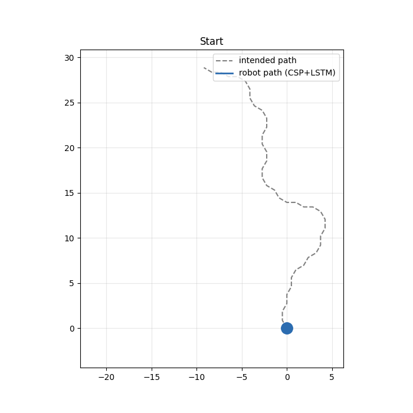
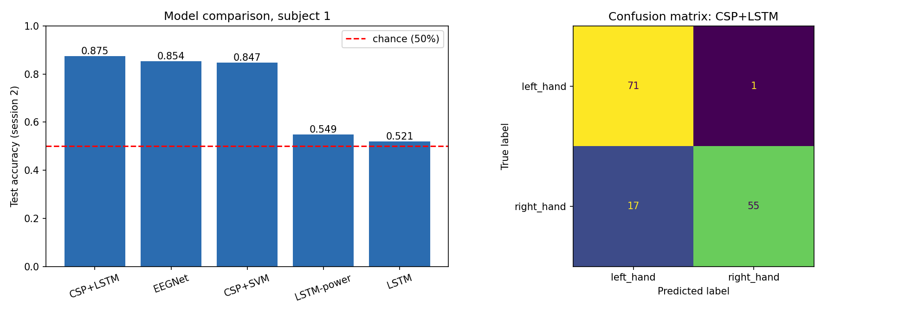
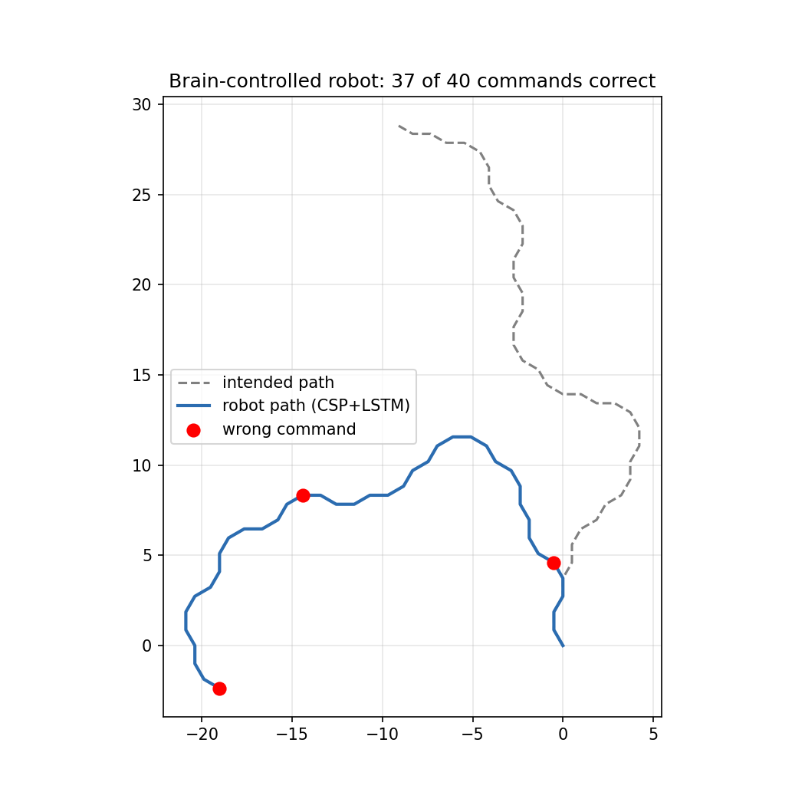

# Mind-Controlled Robot: Motor Imagery EEG Classification with SVM, CNN and RNN

A brain-computer interface (BCI) pipeline that decodes imagined left-hand and right-hand movements from EEG signals and uses the decoded commands to steer a simulated mobile robot. Five models spanning classical machine learning, convolutional networks and recurrent networks are trained and compared under the official cross-session evaluation protocol.



## Results at a Glance

| Model | Family | Test accuracy | Cohen's kappa | Correct trials (of 144) |
|---|---|---|---|---|
| CSP + LSTM | RNN | **0.875** | **0.750** | 126 |
| EEGNet | CNN | 0.854 | 0.708 | 123 |
| CSP + SVM | SVM | 0.847 | 0.694 | 122 |
| LSTM on log-power sequences | RNN | 0.549 | 0.097 | 79 |
| LSTM on raw EEG | RNN | 0.521 | 0.042 | 75 |

Subject 1, trained on recording session 1 and tested on recording session 2. Chance level is 0.50.



## Dataset

The project uses the **BCI Competition IV 2a** dataset, loaded through the MOABB library as `BNCI2014_001`. Each subject was recorded with 22 EEG electrodes at 250 Hz across two sessions on different days. Only the left-hand and right-hand motor imagery classes are used, giving 144 trials per session with 72 trials per class.

## Methodology

### Preprocessing

The signal is band-pass filtered to 8 to 30 Hz, which covers the mu (8 to 13 Hz) and beta (13 to 30 Hz) rhythms. During imagined hand movement, power in these bands decreases over the motor cortex on the opposite side of the brain, a phenomenon known as event-related desynchronisation. Each trial is cropped to the window from 0.5 to 2.5 seconds after the cue, excluding the initial visual response. For the neural networks, each channel is standardised using statistics computed on the training session only.

### Evaluation protocol

Models are trained on session 1 and tested on session 2. Random train/test splits on this dataset mix trials from the same day into both sets and overstate performance, because EEG characteristics drift between recording sessions. The cross-session protocol reflects realistic use, where a person returns on a different day. For the neural networks, a stratified 20 percent of session 1 is held out as a validation set for early stopping; session 2 is used only for final evaluation.

### Models

**CSP + SVM.** Common Spatial Patterns learns six spatial filters that maximise the variance difference between the two classes. The log-variance of each filtered signal forms a six-dimensional feature vector, which is standardised and classified by an RBF-kernel support vector machine.

**EEGNet.** A compact convolutional network designed for EEG (Lawhern et al., 2018). A temporal convolution learns frequency filters, a depthwise convolution learns spatial filters across the 22 channels, and a separable convolution combines these patterns over time. Dropout and max-norm weight constraints control overfitting on the small training set.

**LSTM variants.** Three recurrent models were trained to investigate the effect of input representation:

1. Raw EEG, decimated to 62.5 Hz, giving sequences of 126 steps by 22 channels.
2. Log-power computed in 100 ms windows on the raw channels, giving 20 steps by 22 channels.
3. Log-power computed in 100 ms windows on six CSP-filtered signals, giving 20 steps by 6 channels.

All neural networks share the same training procedure: Adam optimiser, learning rate 0.001, batch size 16, and early stopping on validation loss with restoration of the best weights.

### Robot simulation

Each decoded test trial is converted into a steering command for a simulated mobile robot. A left command rotates the heading by 30 degrees anticlockwise, a right command by 30 degrees clockwise, and the robot then advances one unit. The path driven by the decoded commands is plotted against the path the user intended.



## Key Findings

**Spatial filtering is the decisive ingredient.** The LSTM moved from chance level (0.521) to the best result (0.875) solely by changing its input from raw channels to CSP-filtered power sequences. The model architecture was unchanged. Motor imagery information is spread thinly across many electrodes, and with only 115 training trials a sequence model cannot discover the relevant channel combinations on its own. EEGNet succeeds without CSP because its depthwise convolution learns an equivalent spatial filter.

**The three strong models perform comparably.** Accuracies of 0.847, 0.854 and 0.875 correspond to 122, 123 and 126 correct trials out of 144. A difference of three to four trials on a single subject is not sufficient evidence that one model is superior.

**The best model is biased towards the left class.** The confusion matrix shows 71 of 72 left-hand trials decoded correctly, compared with 55 of 72 right-hand trials. Nearly all errors are right-hand trials classified as left. A plausible cause is the shift in signal characteristics between the two recording sessions.

**Open-loop control amplifies small error rates.** The robot executed 37 of 40 commands correctly (92.5 percent), yet finished far from the intended destination. Each wrong command produces a permanent 60-degree heading error, and every subsequent step inherits it. Because the errors are biased towards the left, the robot drifts consistently in one direction. Practical BCI systems address this with closed-loop feedback, in which the user observes the robot and corrects its course.

## Repository Structure

```
bci_mind_controlled_robot.ipynb   Complete pipeline: data loading, models, evaluation, simulation
results_subject1.csv              Accuracy and kappa for every model
model_comparison.png              Accuracy bar chart and confusion matrix
robot_path.png                    Intended versus decoded robot path
robot_demo.gif                    Animated robot simulation
requirements.txt                  Library versions used
```

## How to Run

1. Open `bci_mind_controlled_robot.ipynb` in Google Colab.
2. Select `Runtime > Change runtime type > T4 GPU`.
3. Run all cells in order. The dataset downloads automatically on first run.

To evaluate a different subject, change `SUBJECT` (1 to 9) in the configuration cell and re-run the notebook.

## Limitations

The results cover a single subject, and EEG decoding performance varies considerably between individuals. The robot is driven by replayed recorded trials rather than a live EEG headset, so the system is an offline simulation of a BCI control loop. The validation set contains only 29 trials, which makes early stopping decisions noisy.

## Future Work

Planned extensions include evaluation across all nine subjects, cross-subject transfer learning, a confidence threshold that issues no command when the classifier is uncertain, and a closed-loop simulation in which the robot navigates towards a goal.

## Technology

Python, MNE 1.13.2, MOABB 1.7.2, TensorFlow 2.20.0, scikit-learn 1.6.1, NumPy, pandas, Matplotlib. Developed in Google Colab with a T4 GPU.

## References

1. Tangermann, M. et al. (2012). Review of the BCI Competition IV. *Frontiers in Neuroscience*, 6, 55.
2. Lawhern, V. J. et al. (2018). EEGNet: a compact convolutional neural network for EEG-based brain-computer interfaces. *Journal of Neural Engineering*, 15(5), 056013.
3. Ramoser, H., Muller-Gerking, J. and Pfurtscheller, G. (2000). Optimal spatial filtering of single trial EEG during imagined hand movement. *IEEE Transactions on Rehabilitation Engineering*, 8(4), 441-446.
4. Jayaram, V. and Barachant, A. (2018). MOABB: trustworthy algorithm benchmarking for BCIs. *Journal of Neural Engineering*, 15(6), 066011.

## Author

Nikshiptha Gaddam, B.Tech Electronics and Communication Engineering (Robotics and Automation), KLH University.
